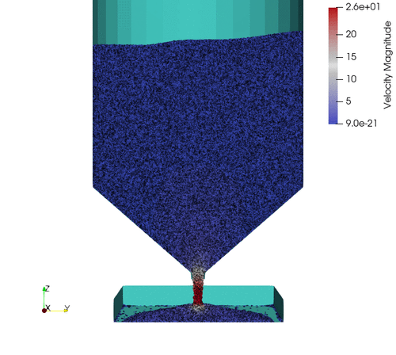

# Summary 

`ExaDEM` is a Discrete Element Method (`DEM`) code developed using the `exaNBody` framework [@carrard2023exanbody] at the French atomic commission (`CEA`). This software provides `DEM` modeling capabilities to enable the modeling of mechanical interactions occuring at contact between spheres and polyhedra particles while offering performance optimizations on modern `HPC` platforms. A notable aspect of `ExaDEM` stands in its hybrid parallelization approach, combining the use of `MPI` and Threads (OpenMP). Additionally, `ExaDEM` offers portability to clusters of `GPU`s, using the `CUDA` programming model and `MPI` for `DEM` simulations with spherical particles. Developed in `C++17`, `ExaDEM` is designed to offer `HPC` capabilities to the scientific community. 

# Statement of need

A comprehesive description of the behavior of granular media remains a significant challenge for the scientific community. `DEM` simulations enhance our knowledge by examining phenomena that are otherwise unreachable or too costly to study through experiments. To accurately reproduce these phenomena originated at particle scale, we must simulate a representative number of particles, ranging from thousands to billions. While a single processor can easily handle simulations involving thousands of particles, simulating millions requires `HPC` resources. These simulations are constrained either by memory footprint or excessively long execution time. The `DEM` method is inherently parallel, with various techniques avaiable, such as spatial domain decomposition [@plimpton1995fast], thread parallelization over cells and vectorization. In this paper, we introduce the code `ExaDEM`, designed for large-scale `DEM` simulation on `HPC` platforms. This code leverages numerous features of the `exaNBody` framework, including data structure management, `MPI`+X parallelization and add-on modules (optimized `IO`, Paraview export).

# DEM Background

The `DEM` method, employed to study granular media, falls within the scope of so-called N-body methods. It involves numerically replicating the kinetics and interactions of a collection of rigid particles over time. Time is divided into discrete steps, where at each step n, Newton's equation **f**=m**a** is solved to determine the translation and rotation acceleration for each particle. Subsequently, the corresponding velocity and moment are computed, leading to the calculation of the new position at step n+1. The force **f** is evaluated from particle interactions, including contact interactions (normal and tangential force) and external forces such as gravity. A commonly employed numerical scheme is the Velocity Verlet, while the Hooke law is often used to model contact interactions. The versatility of the `DEM` method allows for simulating rigid bodies with various shapes, ranging from spherical to polyhedral particles. Note that in `ExaDEM`, complex particle shapes are handled using a sphero-polyhedral approach, facilitating simplified contact detection and representing intricate shapes [@alonso_marroquin_2008]. For clarity, the term "polyhedron" is used to refer to a sphero-polyhedral particle.

Efficient neighbor particle detection is a critical aspect of `DEM` simulation codes. Typically, this is achieved by combining the linked cells method [@ciccotti1987simulation] and Verlet lists [@verlet1967computer], which optimize neighbor searches using a cartesian grid of cells (with a complexity of N, N is the number of particles) while limiting the refresh rate of neighbor lists.  
  
Several `DEM` software packages have emerged in recent years, offering `HPC` capabilities. Examples include `LIGGGHTS` [@kloss2012models], which is based on `LAMMPS` [@thompson2022lammps] data structures for Molecular Dynamics simulations with spherical particles (`MPI`), and `Blaze-DEM` [@govender2018study] which employs spheres and polyhedra on `GPU` via `CUDA`. `ExaDEM` aims to establish itself as a software solution that combines `MPI` parallelization, `OpenMP` thread parallelization for both polyhedral and spherical particles, and `CUDA` `GPU` parallelization for spherical particles. Similar to `LIGGGHTS` with `LAMMPS`, `ExaDEM` benefits from various `HPC` features developed in the Molecular Dynamics code `ExaSTAMP` [@cieren2014exastamp] that have been mutualized in the `exaNBody` framework such as `AMR` data structures [@prat2018combining] with load balancing [@prat2020amr], generation of compact particle configurations [@JOSIEN2024109354], and In-situ analysis [@dirand2018tins]. `ExaDEM` aims to incorporate the physics of interest from the `Rockable` [@richefeu_2016, @gitrockable] (open source), originally created at CNRS for polyhedra on a `HPC` framework. To the best of our knowledge, this is a non-exhaustive list of other well-known `DEM` codes: `EDEM` (not open source), `Rocky DEM` (not open source), `MercuryDPM` [@weinhart2020fast] (open source), and `Yade` [@smilauer2023yade] (open source).

# Implementation Details

`ExaDEM` leverages the `exaNBody` data structures (grid, cells, fields) as well as key parallel algorithms (domain decomposition, particles migration, numerical schemes) while proposing `DEM`-specific mechanism. `ExaDEM` achieves a `MPI` parallelization where the simulation domain is decomposed into subdomains using spatial domain decomposition and the Recursive Coordinate Bisection (`RCB`) partitioning method to evenly distribute the workload among `MPI` processes. Particle information stored within these cells, and a subdomain corresponds to a grid of cells. The use of cells aims to apply the state-of-the-art linked cells method to expedite neighbor searches with a complexity of O(N), where N represents the number of particles. Additionally, the Verlet lists method maintains larger neighbor lists over timesteps as long as a particle has a displacement shorter than half of the Verlet radius. Regarding the data layout, it is decomposed into two levels. The first level consists of cells (`SOA`), each composed of fields (`Array`) containing particle data. The second level is associated with the grid of cells (`AOSOA`), corresponding to a subdomain. The `DEM` grid includes the following fields: type, position, velocity, acceleration, radius, angular velocity, orientation. The `AOSAO` data structure facilitates data movement between `MPI` processes while maintaining good data locality, ensuring that particles in the same cell or neighboring cells interact with a good memory hit ratio. Moreover, the use of `SOA` storage (cell layout) enhances the use of `SIMD` instructions.

Regarding the intra-`MPI` parallelization, we distinguish two main differences based on the type of particle, i.e. sphere or polyhedron: 

- For spherical particles, `OpenMP` parallelization involves iterating over cells. In `GPU` parallelization, a block of `GPU` threads is assigned to a cell, with each `GPU` thread processing a particle.
- For polyhedral particles, another parallel level is chosen for thread parallelization, the interaction. Unlike spherical particles, polyhedra can have multiple contacts of different types (vertex-vertex, vertex-edge, vertex-face, edge-edge). Hence, it is more effective to consider interactions rather than cells to achieved thread-parallelization. However, this strategy introduces synchronizations, such as the usage of mutexes. The `GPU` parallelization of polyhedra is still an upcoming development.

In conclusion, the design of `ExaDEM`, guided by `exaNBody` framework, facilitates the addition or removal of individual operators or features without disrupting other functionalities, provided theses operators are independents. For instance, removing the `gravity_force` from the `ExaDEM` repository is feasible, while ensuring the preservation of the `contact_neighbor` operator (building neighbor lists for every particle), which is crucial for running the `hooke_force` operator. Significant efforts have been made to minimize interactions between operators, simplifying the process of adding or removing new modules/operators. 

# Main Features

{width=85%}

{width=70%}

`ExaDEM` aims to to meet scientific expectations, particularly for nuclear fuel simulations involving scenarios such as rotating drums (see figure \ref{fig:rotating-drum}) or compaction processes. To achieve this goal, `ExaDEM` provides the following key features:

- Handling of different particle types: spherical and polyhedral,
- Hybrid parallelisation `MPI` + X,
	- X = `OpenMP` or `CUDA` for spherical particles,
	- X = `OpenMP` for polyhedral particles,
	- The Recursive Coordinate Bissection method is used for the load balancing,
- I/O support for check and restart files (MPIIO files),
- Paraview output files containing fields,
- Drivers: rigid wall, rotating drum or mesh of polyhedron surface for complex geometries such as funnel (see figure \ref{fig:funnel}),
- Time integration scheme: Velocity Verlet,
- Contact detection: Linked-cell method and Verlet Lists,
- Force fields: contact force (Hooke law), cohesive force, and gravity.

All these functionalities are likely to evolve to accomodate new development needs, such as the addition of particle fragmentation. It is worth noting that most of these functionalities have been rigorously tested over 500 million spheres or 10 million polyhedra over ten thousand cores with hybrid `MPI` + `OpenMP` programming on AMD EPYC Milan 7763 processors.

# Future of `ExaDEM`

In the upcoming years, we plan to add several `DEM` features such as complex geometries (propeller), particle fragmentation, and additional diagnostics/outputs. On the other hand, we will develop other parallel strategies, especially on `GPU`, to run on future supercomputers. A specific focus will be done for handling properly polyhedron particles. `ExaDEM` is available under an APACHE 2 license at \url{https://github.com/Collab4exaNBody/exaDEM.git} and the documentation is available at \url{https://github.com/Collab4exaNBody/doc_exaDEM.git}.

# Acknowledgements

This work was performed using HPC resources from CCRT funded by the CEA/DEs simulation program. `ExaDEM` is part of the `PLEIADES` platform which has been developped in collaboration with the French nuclear industry - mainly CEA, EDF, and Framatome - for simulation of fuel elements.
