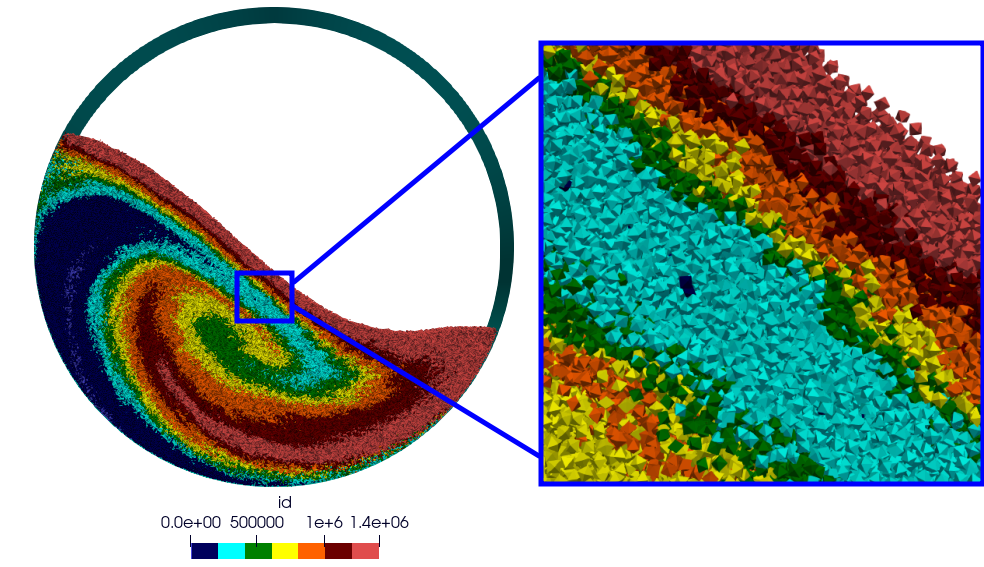

# Summary 

`ExaDEM` is a Discrete Element Method (`DEM`) code developed using the exaNBody framework [@carrard2023exanbody] at the french atomic commission (CEA). This software provides `DEM` functionalities to model spheres and spheropolyhedra while proposing performance optimizations on current HPC plateforms. A notable aspect of `ExaDEM` is its hybrid parallelization approach, which combines the use of MPI and Threads (OpenMP). Additionally, `ExaDEM` offers compatibility with `MPI`+`GPU`s, using the `CUDA` programming model (named `Onika` layer) for DEM simulations with spherical particles. Written in `C++17`, `ExaDEM` aims to provide HPC capabilities for scientific community. `ExaDEM` intends to embed the physics of interest developed in the `Rockable` code develooped at CNRS.  

# Statement of needs

The behavior of granular media is still an open issue for the scientific community and DEM simulations improve our knowledges by studying phenomena that are unreachables, or expensive, to examine with experimentations. However, to repoduce such phenomena, we need to simulate a representative number of particles that can reach thousands particles to billion of particles. To simulate thousand particles, a current single processor can achieved such simulations while simulating millions of particles required HPC ressources. These simulations are either limited by the memory footprint, either by the runtime. The `DEM` method has the advantage to be naturarly parallel and several works exist for this subjects, spatial domain decomposition [@plimpton1995fast], thread parallelization over cells and so on. In this paper we highlight our code `ExaDEM` designed to achieve large scale DEM simulation on HPC platform. This code relies on many features of the exaNBody framework, including data structure management, MPI+X parallelization and add-on modules (IO, Paraview).

# DEM Background

The `DEM` method, used to study granular media, falls within the scope of so-called N-body methods. It consists in numerically reproducing the evolution of a set of rigid particles over time. Time is discretized into time steps and at each time step n, we solve Newton's equation f=ma to deduce the acceleration for each particle and then calculate its velocity, which will give us the new positions at time n+1. "f" is computed from interaction between particules, i.e. contact interactions or external forces such as gravity. A usual numerical scheme used is the Velocity Verlet and to model contact interaction, Hooke is widely used. The DEM method allows to simulate rigid bodies with differents shape: from spherical particle to polyhedral particles. 

A crucial point for `DEM` simulation code is dicted by the need to figure out quickly the nearest neighbor particles to compute contact interactions. The common way to do it is to use the fuse between the linked cells method [@ciccotti1987simulation] and Verlet lists [@verlet1967computer] that limits the refresh rate of neighbor lists while optimizing the neighbor search using a cartesian grid of cells (complexity of N).   

Several DEM softwares have been developped over the last year and propose HPC features such as LIGGGTHS [@kloss2012models] based on LAMMPS [@thompson2022lammps] data structures (Molecular Dynamics code) with spherical particles (MPI) or Blaze-DEM [@govender2018study] with spheres and polyhedra on GPU using CUDA. `ExaDEM`'s objective is to position itself in the literature as a software product that combines MPI parallelization with OpenMP thread parallelization and CUDA GPU parallelization for polyhedral and spherical particles. As LIGGGTHS with LAMMPS, `ExaDEM` takes advantage of several HPC developpements done in `ExaSTAMP` (Molecular Dynamics code) [@cieren2014exastamp] that have been mutualized in the `ExaNBody` framework such as `AMR` data structures [@prat2020amr] or In-situ analysis [@dirand2018tins].

# Implementation

`ExaDEM` takes avantage of `exaNBody` data structures (grid, cells, fields) and main parallel algorithms (domain depcomposition, particles migration, numerical schemes) while integrating DEM specificities.  

`ExaDEM` acheives an `MPI` parallelization by decomposing the simulation domain into subdomains with spatial domain decomposition and the Recursive Coordinate Bissection to evenly distribute the workload among `MPI` processes. A subdomain corresponds to a grid of cells while particle informations are stored into cells. The use of cells aims to apply the state-of-the-art linked cells method to speedup the neighbor search (complexity O(N), with N the number of particles) while the Verlet lists method aims to maintain bigger neighbor lists on several timesteps as long as a particle has not displaced more than 1/2 of the Vertle radius. 

Data layout: 3 levels, the grid (AOSOA) associatied to a subdomain, the cell (SOA) and the field (Array). Note that the DEM grid contains the fields: type, position, velocities, accelerations, radius, angular velocties, orientation. The AOSAO data structure facilitate data movement between `MPI` processes while maintaining a good data locality, i.e. particles in a same cell or in a neighbor cell can interact. The SOA storage (cell layout) improve the use of SIMD instructions. 

About the intra-`MPI` parallelization, we distingue two main differences corresponding to the type of particle, i.e. sphere or sphero-polyhedron: 

- For spherical particles, the OpenMP parallelization is done by iterating over cellsi, about the GPU parallelization, a block of GPU threads is attributed to a cell and each GPU threads works on a particle. 
- For spheropolyhedron particles, another parallism level is added for thread parallelization, the interaction. Indeed, in the opposite of spherical particles, two spheropolyhedra can have multiple contacts with different types (vertex-vertex, vertex-edge, vertex-face, edge-edge), therefore it is perferable to consider interaction than particle pairs or cells to achieved thread-parallelization, whereas this strategy add costly synchronizations (mutex). The GPU parallelizarion of sphero-polyhedra is upcomming.

Finally, it is important to note that the design of `ExaDEM` lead by the framework `ExaNBody` allors to add or remove one operator / feature withou impacting the other functionnalities as long as operators are independents. For example, the gravity force operator can be removed from the `ExaDEM` repository while the contact_neighbor operator (building neighbor lists for every particle) is required to runs the hooke force operator. Efforts have be done to limit interactions between operators in order to add or remove easily new modules / operators coded by a new developper. 

# Main features

{width=80%}

`ExaDEM` attends to meet scientific expectations, espacially for fuel nuclear simulations consisting in rotating drum (see figure \ref{fig:rotating-drum}) or compression simulations. To do it, `ExaDEM` provides the following features:

- Handle different particle types: spherical and spheropolyhedral particles
- Hybrid parallelisation MPI + X
	- X = OpenMP or CUDA for spherical particles
	- X = OpenMP for spheropolyhedron particles
	- The Recursive Coordinate Bissection method is used for the load balancing
- I/O support for check and restart files (MPIIO files)
- Paraview output files containing fieds
- Drivers: Wall, Rotating drum or mesh of polyhedron surface for complex geometries such as funnel (see figure X).
- Numericall Scheme: Verlet Vitess
- Contact detection: Linked-cell method and Verlet Lists
- Force fields: contact force (Hooke law), cohesive force, gravity, and quadratic force

All these functionalities are subject to evolution in line with new development needs, such as the addition of particle fragmentation. Note that most of these functionnalities have been tested over 500 millions spheres or 10 millions polyhedra over ten thousands cores in `MPI` + `OpenMP` on AMD EPYC Milan 7763 processors.

# Future of `ExaDEM`

In the upcoming years, we plan to add several `DEM` functionnalities such as complexe geometries (propeller), particle fragmentation, or more diagnostics. On the other hand, we will develop other parallel strategies, espacially on GPU, to run on future supercomputers. A specific focus will be done for simulation sphero-polyhedron particles. `ExaDEM` is available under an APACHE 2 license at https://github.com/Collab4exaNBody/exaDEM.git and the documentation is available at https://github.com/Collab4exaNBody/doc_exaDEM.git.
