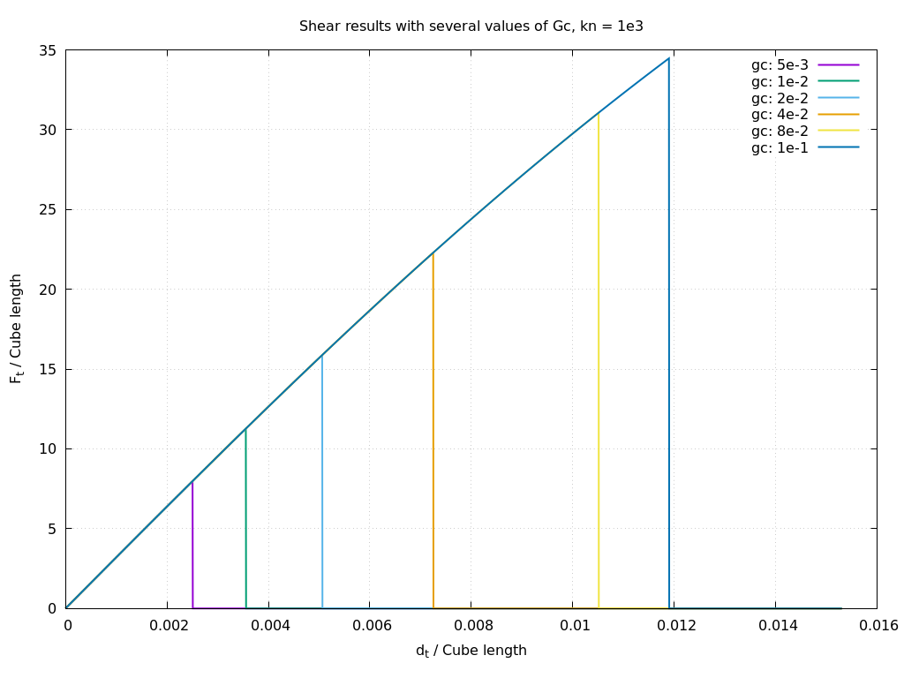

# Shear Verification test

## Description

The test consists of bonding two cubes of identical dimensions at an interface, then prescribing a zero displacement to the first cube and a displacement of [0, 0, 0.01] to the second. Different failure criteria are evaluated to verify the correct calculation of the normal contact behavior at the interfaces. For the tangential behavior, please refer to the shear test

## Modifications in exaDEM

The following lines were modified during the calculation of InnerBond interactions in order to ignore the calculation of normal forces and ensure that they are taken into account in the failure threshold.

File: `exaDEM/src/forcefield/include/exaDEM/forcefield/inner_bond_force.hpp`

```
-  double fn = fne + fnv;
+  //double fn = fne + fnv;
+  double fn = 0.0; //fne + fnv;

...
   Et = 0.5 * ibp.kt * dot(tds, tds);  // 0.5 * kt * norm2(vt * dt); with  vt = (vel - (vn * n));
+  En = 0.0;
```


## Numerical Results

The following graph shows the evolution of the tangential force $F_t$ relative to the displacement $d_t$ for various critical energy release rates ($G_c$) with a normal stiffness $k_t = 8.e2$.



Note that the surface area used is 0.98x0.98 while the surface is forced to 1.0 in `Rockable`.

[Rockable Analysis](rockable_res.pdf)

