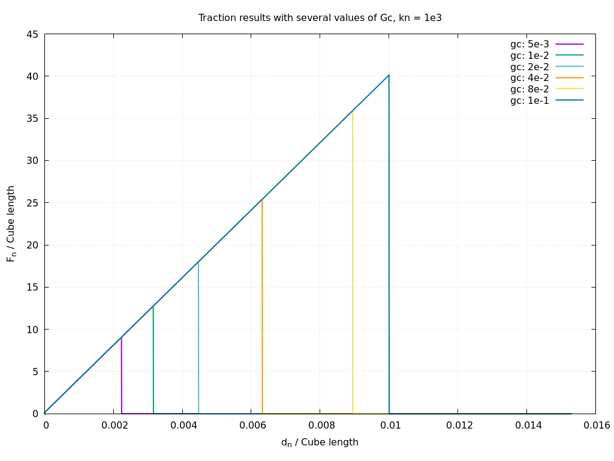

# Traction Verification test

## Description

The test consists of bonding two cubes of identical dimensions at an interface, then prescribing a zero displacement to the first cube and a displacement of [0.01, 0, 0] to the second. Different failure criteria are evaluated to verify the correct calculation of the normal contact behavior at the interfaces. For the tangential behavior, please refer to the shear test

## Numerical Results

The following graph shows the evolution of the normal force $F_n$ relative to the displacement $d_n$ for various critical energy release rates ($G_c$) with a normal stiffness $k_n = 10^3$.

Note that the surface area used is 0.98x0.98 while the surface are is forces to 1.0 in `Rockable`.

[Rockable Analysis](rockable_res.pdf)

Based on the simulation results, the failure occurs at specific displacement thresholds depending on the $G_c$ value:

| $G_c$ Value | Displacement at Failure ($\delta_n$) | Computed Area ($A_i$) |
| :--- | :--- | :--- |
| $5 \times 10^{-3}$ | $\approx 0.0022$ | $A_1 \approx 0.0100$ |
| $1 \times 10^{-2}$ | $\approx 0.0031$ | $A_2 \approx 0.0200$ |
| $2 \times 10^{-2}$ | $\approx 0.0044$ | $A_3 \approx 0.0400$ |
| $4 \times 10^{-2}$ | $\approx 0.0063$ | $A_4 \approx 0.0799$ |
| $8 \times 10^{-2}$ | $\approx 0.0089$ | $A_5 \approx 0.1597$ |
| $1 \times 10^{-1}$ | $\approx 0.0100$ | $A_6 \approx 0.1996$ |

